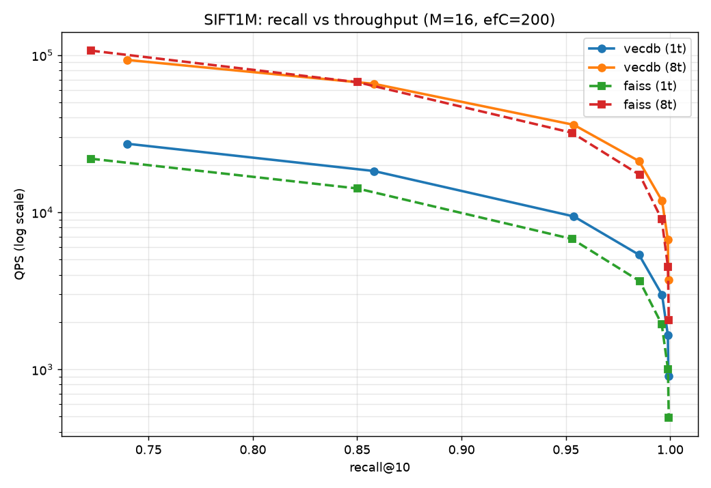
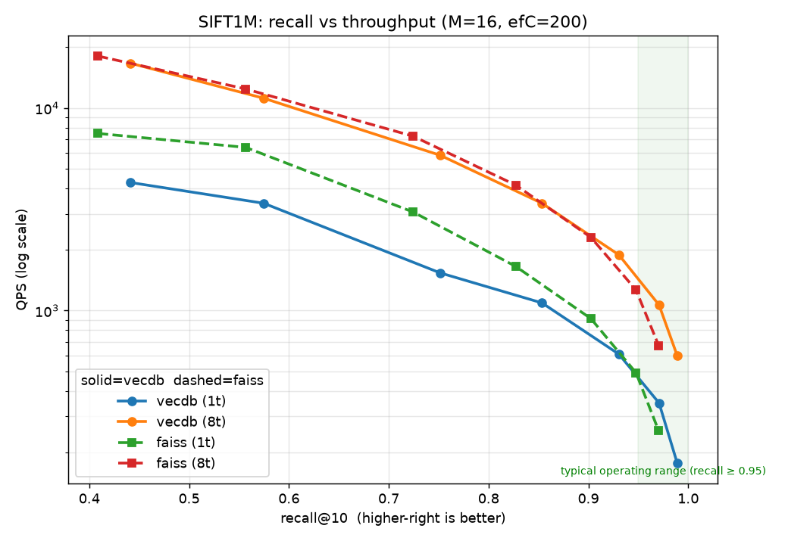

# vecdb — a vector search engine in C (HNSW + SIMD)


[](https://pypi.org/project/vecdbc/)

`vecdb` is a dependency-light vector search engine implemented in C11 with Python bindings through `ctypes` — the same category as FAISS, hnswlib, and Annoy: an embedded similarity-search index, not a full database server. It stores fixed-size `float32` vectors and supports exact and approximate nearest-neighbor search using squared L2 distance, with hand-written SIMD kernels (AVX-512 on x86, NEON on ARM), training-free quantization, and a hybrid quantized-graph index.

It is a search *engine*, not a vector *database* in the Qdrant/Weaviate/Milvus sense: there is no transaction log, no network/query server, no sharding or replication, and no schema/payload management. Those systems are typically built *on top of* an index like this one (Milvus, for instance, wraps FAISS/hnswlib). What vecdb provides is the index layer — fast search, CRUD on vectors, metadata filtering, persistence, and concurrency — done from scratch and benchmarked head-to-head against FAISS on SIFT1M and GIST1M.

## What it implements

- **Flat exact search** — brute-force L2 scan.
- **Blocked exact batch search** — processes up to 8 queries per pass so one vector load feeds multiple query accumulators.
- **HNSW approximate search** — graph index using greedy descent, beam search (`ef`), and heuristic neighbor selection.
- **Binary persistence** — save/load an index with vectors, IDs, levels, and neighbor links.
- **Delete API** — O(1) tombstone deletes by user ID, with stable recall under churn and a `compact()` rebuild to reclaim space.
- **Filtered search** — restrict any search to an allow-list or away from a deny-list of IDs; HNSW traverses through filtered nodes so selective filters cannot disconnect the search.
- **Concurrent reads** — searches are thread-safe (per-thread visited buffers, no shared mutable state); any number of threads may search one index simultaneously. Writes require external exclusion.
- **OpenMP batch search** — `make OMP=1` parallelizes batched HNSW, exact, and TurboQuant searches over queries. Single-threaded behavior is unchanged; results are identical either way.
- **Parallel insert (experimental)** — `add_bulk(ids, vecs, threads=N)` builds the HNSW graph concurrently using a published-node model: a node becomes a traversal target (atomic release/acquire flag) only after its links are fully wired, and per-node locks guard every link-list read and mutation. Produces a graph of equivalent recall to the serial build (verified to within +-0.02, ASan-clean). Measured 1.73x at 8 threads on an M2 Pro for a 1M-vector build (see scaling table below); the serial path is the default and is byte-identical to repeated single inserts.
- **NEON kernels** — on AArch64 (Apple Silicon, Graviton, ...) the distance kernel, blocked exact scan, and both TurboQuant scans use NEON; the 4-bit codebook decodes via a single `tbl` table register and both quantized scans run on `sdot` (signed x signed, so no zero-point correction). Verified against scalar references under QEMU in CI.
- **Hybrid index (HNSW + TurboQuant + rerank)** — an HNSW graph that traverses on TurboQuant code distances and reranks the top candidates with exact fp32; matches pure-fp32 recall while the resident footprint (codes + graph) is smaller than the fp32 vectors alone.
- **TurboQuant compressed index** — optional 4-bit or 8-bit compressed brute-force index with randomized Hadamard rotation, norm separation, Lloyd-Max Gaussian quantization, and optional QJL residual estimation.

The C API is declared in `vecdb.h`. The Python API lives in `pyvecdb.py` and loads `libvecdb.so` from the project directory by default.

## Install

```sh
pip install vecdbc
```

The package compiles the C core on install (portable SIMD flags — AVX2 on
x86, NEON on Apple Silicon; set `VECDB_AVX512=1` to build the AVX-512 kernels
for a target that supports them). A C compiler is required; OpenMP is used
when available and falls back to serial otherwise. The import name is
`pyvecdb`:

```python
import numpy as np
from pyvecdb import VecDB

db = VecDB(dim=128)
db.add(np.random.rand(10_000, 128).astype(np.float32))
ids, dists = db.search(np.random.rand(5, 128).astype(np.float32), k=10)
```

(The distribution name is `vecdbc` because `vecdb` was taken on PyPI; the
module you import is still `pyvecdb`.)

## Build from source

Requirements:

- `clang`
- `numpy` for the Python bindings
- A Unix-like shell with `make`

```sh
make clean
make
```

`make` builds `libvecdb.so`. Build the demo program separately:

```sh
make bench
```

Useful targets:

| Target | Result |
|--------|--------|
| `make` / `make all` | Builds `libvecdb.so` |
| `make bench` | Builds the `bench` demo executable |
| `make clean` | Removes `.o`, `.so`, and `bench` build artifacts |

The Makefile uses `-O3 -march=native`, so generated binaries are machine-specific. If you need to override the compiler or flags:

```sh
make clean
make CC=clang CFLAGS="-O3 -Wall -Wextra -fPIC"
```

For local Python use, run scripts from the repo root or set `PYTHONPATH=.`:

```sh
PYTHONPATH=. python script.py
```

`pyvecdb.py` loads `libvecdb.so` from the same directory as the Python file. To load a library from somewhere else, set `VECDB_LIB`:

```sh
VECDB_LIB=/path/to/libvecdb.so PYTHONPATH=. python script.py
```

## Quick start

```sh
make
make bench
./bench 50000 128
```

`bench` generates random vectors, inserts them into an HNSW index, runs one approximate query, prints the top result, and writes `index.vecdb`.

## Python API

`pyvecdb.py` exposes two index classes:

| Class | Purpose |
|-------|---------|
| `VecDB` | Full vector index with flat exact search, HNSW approximate search, delete, save, and load |
| `TQIndex` | TurboQuant compressed brute-force index |
| `HybridIndex` | HNSW over TurboQuant codes with fp32 rerank (Design A + B) |

### `VecDB`

```python
from pyvecdb import VecDB

db = VecDB(
    dim=128,
    M=16,
    ef_construction=200,
    capacity=1024,
    seed=0x9E3779B97F4A7C15,
)
```

Constructor arguments:

| Argument | Meaning |
|----------|---------|
| `dim` | Vector dimensionality |
| `M` | HNSW max links per node on upper layers; level 0 uses `2 * M` |
| `ef_construction` | HNSW beam width during inserts |
| `capacity` | Initial vector capacity; the index grows automatically |
| `seed` | Deterministic RNG seed for HNSW level sampling |

Core methods:

```python
db.add(vectors, ids=None)          # returns None; ids default to current_count..current_count+n
db.delete(ids)                     # O(1) per id; raises RuntimeError if any id is missing
db.compact()                       # rebuild without tombstones after many deletes
ids, distances = db.search(queries, k=10, ef=100, exact=False)
ids, distances = db.search(queries, k=10, allow_ids=some_ids)   # filtered
ids, distances = db.search(queries, k=10, deny_ids=other_ids)
db.save(path)
loaded = VecDB.load(path)
len(db)                            # number of stored vectors
db.dim                             # vector dimensionality
```

Input requirements:

- `vectors` and `queries` must be convertible to contiguous `float32` arrays.
- Shape must be `(n, dim)`; a 1D vector is accepted as `(1, dim)`.
- `ids`, when provided, must be shape `(n,)`.
- `ef` is clamped up to `k` if `ef < k`.

`search()` returns `(ids, distances)`, both shaped `(n_queries, k)`. Missing result slots are filled with `id = 2**64 - 1` and `dist = inf`. Distances are squared L2 values.

Example:

```python
import numpy as np
from pyvecdb import VecDB

vectors = np.random.rand(10_000, 128).astype(np.float32)
ids = np.arange(vectors.shape[0], dtype=np.uint64)

db = VecDB(dim=128, M=16, ef_construction=200)
db.add(vectors, ids)

queries = vectors[:5]
flat_ids, flat_dists = db.search(queries, k=10, ef=100, exact=True)
hnsw_ids, hnsw_dists = db.search(queries, k=10, ef=100, exact=False)

db.delete(np.array([42], dtype=np.uint64))

db.save("index.vecdb")
loaded = VecDB.load("index.vecdb")
```

Delete semantics: `VecDB.delete()` is O(1) per ID via an internal id->slot
hash map. Deleted nodes are tombstoned: they keep carrying HNSW graph
connectivity (traversal passes through them, so deleting hub nodes cannot
orphan graph regions) but are excluded from all search results, exact scans,
and counts. Tombstoned slots are not reused; after heavy churn, call
`db.compact()` to rebuild the index without them. In a 5-cycle churn test
(30% turnover per cycle, 10k vectors), recall@10 stayed in 0.95-0.97 with
no degradation trend. Adding a duplicate live ID is rejected with an error.

### `TQIndex`

```python
from pyvecdb import TQIndex

tq = TQIndex(dim=128, bits=4, qjl=False, seed=123)
```

Constructor arguments:

| Argument | Meaning |
|----------|---------|
| `dim` | Vector dimensionality; internally padded to the next power of two |
| `bits` | `4` or `8` bits per coordinate |
| `qjl` | Enable TurboQuant-prod residual estimation |
| `seed` | Deterministic RNG seed for Hadamard signs and QJL projection |

Core methods:

```python
tq.add(vectors, ids=None)
ids, distances = tq.search(queries, k=10)
bytes_used = tq.memory_bytes()
len(tq)
```

TurboQuant is a compressed brute-force index, not an HNSW graph. It currently exposes `add`, `search`, `memory_bytes`, and `__len__`; it does not expose delete or persistence.

Example:

```python
import numpy as np
from pyvecdb import TQIndex

vectors = np.random.rand(10_000, 128).astype(np.float32)
ids = np.arange(vectors.shape[0], dtype=np.uint64)

tq = TQIndex(dim=128, bits=4, qjl=False)
tq.add(vectors, ids)

queries = vectors[:5]
tq_ids, tq_dists = tq.search(queries, k=10)
print(tq.memory_bytes())
```

## C API

`vecdb.h` declares the public C interface.

### Types

```c
typedef struct VecDB VecDB;

typedef struct {
    uint64_t id;     /* user-supplied id */
    float    dist;   /* squared L2 distance to query */
} VecResult;

typedef struct {
    int    dim;
    int    M;
    int    ef_construction;
    size_t initial_capacity;
    uint64_t seed;
} VecDBConfig;
```

Return semantics:

- `vecdb_create()` returns `NULL` on invalid config or allocation failure.
- `vecdb_add()` returns the internal index on success, or `-1` on failure.
- `vecdb_delete()` returns `0` on success, or `-1` if the ID is not found.
- `vecdb_compact()` returns `0` on success, `-1` on allocation failure.
- `vecdb_search_*()` returns the number of results written.
- `vecdb_save()` returns `0` on success, or `-1` on failure.
- `vecdb_load()` returns `NULL` on open/read/format failure.

### Example

```c
#include "vecdb.h"

int main(void) {
    VecDBConfig cfg = vecdb_default_config(128);
    cfg.M = 16;
    cfg.ef_construction = 200;
    cfg.initial_capacity = 1024;
    cfg.seed = 0x9E3779B97F4A7C15ULL;

    VecDB *db = vecdb_create(&cfg);
    if (!db) return 1;

    float vec[128]; // fill with your data
    vecdb_add(db, 42, vec);

    float query[128]; // fill with your data
    VecResult out[10];

    int n_flat = vecdb_search_flat(db, query, 10, out);
    int n_hnsw = vecdb_search_hnsw(db, query, 10, 100, out);

    vecdb_delete(db, 42);

    if (vecdb_save(db, "index.vecdb") != 0) return 1;

    VecDB *loaded = vecdb_load("index.vecdb");

    vecdb_free(db);
    vecdb_free(loaded);
    return 0;
}
```

Core C functions:

| Function | Purpose |
|----------|---------|
| `vecdb_default_config(dim)` | Fill a config with defaults: `M=16`, `ef_construction=200`, `initial_capacity=1024` |
| `vecdb_create(&cfg)` | Allocate and initialize a database |
| `vecdb_free(db)` | Free all memory |
| `vecdb_add(db, id, vector)` | Insert one vector |
| `vecdb_delete(db, id)` | O(1) tombstone delete by user ID |
| `vecdb_compact(db)` | Rebuild in place without tombstoned nodes |
| `vecdb_count(db)` | Number of stored vectors |
| `vecdb_dim(db)` | Vector dimensionality |
| `vecdb_search_flat(db, query, k, out)` | Exact single-query search |
| `vecdb_search_flat_batch(db, queries, nq, k, out)` | Exact batched search over up to 8 queries per pass |
| `vecdb_search_hnsw(db, query, k, ef, out)` | Approximate HNSW search (thread-safe for concurrent reads) |
| `vecdb_search_hnsw_filtered(db, query, k, ef, mask, out)` | HNSW search restricted to a slot mask |
| `vecdb_search_flat_batch_filtered(db, queries, nq, k, mask, out)` | Exact filtered batch scan |
| `vecdb_make_mask(db, ids, n, mode, mask)` | Build an allow (mode 0) or deny (mode 1) mask from user IDs |
| `vecdb_slots(db)` | Mask size in bytes (internal slot count incl. tombstones) |
| `vecdb_save(db, path)` | Persist vectors and graph |
| `vecdb_load(path)` | Load a persisted index |

## TurboQuant details

`TQIndex` encodes each vector as a compact code and searches by scanning those codes.

Per-vector encoding pipeline:

1. Store the original norm.
2. Normalize the vector direction.
3. Pad dimension to the next power of two.
4. Apply three rounds of sign flips plus fast Walsh-Hadamard transform.
5. Quantize each rotated coordinate with an analytic Lloyd-Max Gaussian codebook.
6. For 8-bit mode, snap reconstructions to signed int8 and use an AVX512-VNNI scan path when available.
7. Optional QJL mode stores residual sign bits and residual norms for an unbiased inner-product estimator.

Distances returned by `TQIndex.search()` are estimated squared L2 distances for the compressed representation.

## Implementation notes

- Distance metric: squared L2. Cosine search can be done by normalizing vectors before insertion and querying.
- HNSW uses deterministic seeded `xorshift64*` level sampling.
- HNSW search uses epoch-tagged visited marks to avoid clearing a visited array per query.
- Flat batch search uses the identity `||q - x||^2 = ||q||^2 - 2<q,x> + ||x||^2` with cached vector norms.
- `vecdb.c` has AVX-512 and NEON distance kernels; otherwise it falls back to scalar code that is intended to auto-vectorize under `-O3`.
- `turboquant.c` scan paths by target: AVX-512 4-bit register-LUT + VNNI 8-bit on x86; NEON `tbl`+`sdot` for both bit-widths on AArch64 (requires the dotprod extension, ARMv8.2+); scalar otherwise. The NEON 4-bit path scans on the int8 grid (like the VNNI 8-bit path), trading a small amount of raw recall for speed; reranking recovers it.
- OpenMP parallelism applies to batched searches only; index build remains single-threaded. macOS note: Apple clang has no bundled OpenMP — use `brew install gcc` and `make OMP=1 CC=gcc-14`, or build serial (default).
- The Makefile uses `-march=native`, so build artifacts are machine-specific.

## Known limits

- Single writer: add/delete/compact must be externally excluded from each other and from searches. Concurrent searches are safe.
- Very selective allow-lists (under ~1% of vectors) can return fewer than k HNSW results; use `exact=True` or raise `ef` for those.
- Tombstoned slots are not reused by inserts; memory is reclaimed only by `compact()`. Long-running high-churn workloads should compact periodically.
- Parallel insert (`threads>1`) is experimental: correctness is validated by recall-equivalence and AddressSanitizer, but ThreadSanitizer cannot fully verify it because libgomp's `omp_lock_t` synchronization is invisible to TSan (residual reports are lock-protected accesses TSan can't see). The default serial path is the verified one.
- `compact()` rebuilds the whole graph (O(N log N) inserts), so it is a maintenance operation, not a per-delete cost.
- TurboQuant is a brute-force compressed index; it does not build an HNSW graph.
- TurboQuant has no delete or save/load API yet.
- Persistence format is versioned (v2 adds tombstones; v1 files still load) but not a long-term stable external format.

## Project layout

```text
vecdb.h        # C API
vecdb.c        # VecDB storage, flat search, HNSW, persistence
turboquant.c   # TurboQuant compressed index (+ codec API for the hybrid)
hybrid.c       # HNSW-over-codes + fp32 rerank index
pyvecdb.py     # ctypes Python bindings
bench.c        # small random-data smoke/demo program
Makefile       # build rules for libvecdb.so and bench
pyproject.toml # Python package metadata
tests.py       # correctness, churn, filtering, concurrency suite (python tests.py)
.github/       # CI: build + full test suite on every push
benchmarks/    # FAISS/Chroma/Qdrant comparison, quantization shoot-out,
               #   parallel scaling, SIFT1M (standard ANN dataset),
               #   and a recall-QPS Pareto plot vs FAISS
```

## Measured results

All single-threaded, 20k x 128 Gaussian-mixture vectors, recall verified
against exact ground truth (see `benchmarks/` for the scripts):

| index                      | QPS    | recall@10 | note                          |
|----------------------------|--------|-----------|-------------------------------|
| flat exact (8-query block) |  3,928 | 1.000     | 1.9x faster than faiss flat   |
| HNSW ef=50                 | 16,578 | 1.000     | (synthetic; see SIFT1M below) |
| HNSW ef=200                |  8,574 | 1.000     | (synthetic; see SIFT1M below) |
| TurboQuant 4-bit           |  2,235 | 0.622     | beats faiss SQ4; 1.000 w/ rerank |
| TurboQuant 8-bit (VNNI)    |  4,993 | 0.937     | 2.5x faiss SQ8; 1.000 w/ rerank |

Churn stability: 5 cycles of 30% delete+reinsert on 10k vectors held
recall@10 at 0.95-0.97; `compact()` rebuilt 10k vectors in ~1.6s.

### 1M vectors on Apple Silicon (M2 Pro, NEON build, single thread)

1,000,000 x 128 Gaussian-mixture vectors, 200 held-out queries, recall
against exact ground truth (`benchmarks/bench_large.py --n 1000000`):

| ef  | QPS    | recall@10 |
|-----|--------|-----------|
| 10  | 30,666 | 0.618     |
| 50  | 10,691 | 0.926     |
| 100 |  7,471 | 0.978     |
| 200 |  5,427 | 0.989     |
| 400 |  3,836 | 0.999     |

Build: 178s (5,622 vec/s) with capacity preallocated. (Build times are not
comparable across machines — different CPUs, clocks, and memory; in the
parallel table below, compare thread counts within the single M2 Pro run.)

### Parallel insert scaling (M2 Pro, 6 performance + 4 efficiency cores)

1M x 128 clustered vectors, `add_bulk(ids, vecs, threads=N)`, concurrent
HNSW graph construction (gcc-15, `make OMP=1`):

| threads | build | vec/s | speedup |
|---------|-------|-------|---------|
| 1       | 322.8s | 3,098 | 1.00x  |
| 2       | 247.3s | 4,044 | 1.31x  |
| 4       | 203.4s | 4,916 | 1.59x  |
| 6       | 193.4s | 5,170 | 1.67x  |
| 8       | 186.9s | 5,351 | 1.73x  |

The curve flattens after 4 threads — the expected signature of HNSW insert:
a small set of well-connected "hub" nodes are selected as neighbors by most
inserts, so threads serialize on those nodes' locks (plus a global
entry/max_level lock taken twice per insert). hnswlib shows the same
sublinear scaling for the same reason. The graph built concurrently has
recall equivalent to the serial build (verified to within +-0.02). Reducing
the plateau (striped locks, a read-mostly max_level check) is future work.

### Parallel search scaling (M2 Pro, same machine)

Search is read-only over a frozen graph (thread-safe via per-thread visited
buffers), so unlike insert it holds no locks and contends on nothing but the
memory system. 500k x 128 vectors, 10k queries, `set_threads(N)`
(`benchmarks/bench_search_mt.py`):

| threads | HNSW (ef=100) | exact scan | TurboQuant 8-bit |
|---------|---------------|------------|------------------|
| 1       | 1.00x         | 1.00x      | 1.00x            |
| 2       | 1.82x         | 1.94x      | 1.77x            |
| 4       | 3.06x         | 3.55x      | 3.28x            |
| 6       | 3.58x         | 4.36x      | 3.96x            |
| 8       | 3.97x         | 5.17x      | 4.38x            |

The contrast with the insert table is the point: writes contend on hub-node
locks and plateau at ~1.7x; reads share no mutable state and scale near the
performance-core count. Note the exact scan scales *best* (5.17x) despite
being the simplest algorithm — its tight, uniform, fully-independent loop is
the most parallel-friendly, while HNSW's irregular pointer-chasing through
shared graph memory hits the memory system sooner. Even lock-free
parallelism has a ceiling, and here it's bandwidth, not coordination.

### Hybrid index: recall of fp32, memory of codes

The hybrid runs the HNSW graph on TurboQuant codes (Design A) and reranks
the top candidates with exact fp32 (Design B). On 30k x 128 clustered
vectors it reaches recall@10 = 1.000 at ef=200 — matching pure-fp32 HNSW —
while the resident structures (codes + graph; fp32 is memory-mappable) take
~8.8 MB vs 15.4 MB for the fp32 vectors alone. The quantized graph alone
(no rerank) tracks pure-TurboQuant brute force; the rerank is what lifts it
to fp32 parity, and the HNSW neighbor-diversity heuristic on the quantized
graph is what makes the rerank candidates good enough to matter.

```python
from pyvecdb import HybridIndex
h = HybridIndex(dim=128, bits=8, ef_construction=200, rerank_mult=4)
h.add(vectors)                       # stores codes + fp32 (for rerank)
ids, dists = h.search(queries, k=10, ef=200)
h.memory_bytes(include_fp32=False)   # resident footprint w/ mmap'd fp32
```
 On *uniform* random
128-d data the same index scores ~0.42 recall@10 at ef=200 — uniform
high-dimensional data breaks HNSW's navigability assumptions at scale;
that is a property of the data, not the implementation, and is why
`bench_large.py` offers both geometries.

Caveats: x86 numbers from one AVX-512 + VNNI machine, ARM numbers from one
M2 Pro; synthetic clustered data, single thread; the Qdrant comparison in
`benchmarks/benchmark.py` uses qdrant-client's in-process mode, not a
server.

## SIFT1M (standard benchmark dataset)

`benchmarks/bench_sift.py` runs against SIFT1M (Inria TEXMEX): 1M base + 10k
query vectors at dim 128, with a provided ground-truth file of the true 100
nearest neighbors per query. Recall is measured against that canonical answer
key — not our own exact search — so results are directly comparable to
published FAISS / hnswlib / Qdrant numbers.

```sh
wget ftp://ftp.irisa.fr/local/texmex/corpus/sift.tar.gz
tar xzf sift.tar.gz
PYTHONPATH=. python3 benchmarks/bench_sift.py --dir sift --faiss --build-threads 8
```

For the standard recall-vs-QPS Pareto figure (and a multi-threaded
head-to-head — both sides at matched thread counts, since FAISS multi-threads
search too):

```sh
PYTHONPATH=. python3 benchmarks/bench_sift_pareto.py --dir sift --faiss \
    --search-threads 1 8 --plot sift_pareto.png
```

This plots recall@10 vs QPS (log scale) for vecdb and FAISS on the same axes
— the convention ann-benchmarks uses — so the comparison is legible at a
glance rather than read off a table.

### Measured result: vecdb vs FAISS on SIFT1M (M2 Pro)



Recall@10 (x) vs throughput (y, log) on SIFT1M, both at 1 and 8 search
threads. Higher-and-to-the-right is better. vecdb (solid) leads FAISS
(dashed) single-threaded across the whole curve, and multi-threaded across
the operating range (recall ≥ 0.95); FAISS scales better only at the
cheap/low-recall left edge. Regenerate with `benchmarks/bench_sift_pareto.py`.


1M base + 10k queries, dim 128, single-thread search, matched HNSW
parameters (M=16, efConstruction=200), recall against the provided ground
truth:

Matched HNSW params (M=16, efC=200), recall vs the provided ground truth.
Recall is identical to FAISS to ~3 decimals at every ef — same answers,
measured at both 1 and 8 search threads:

| ef  | recall | vecdb 1t | faiss 1t | 1t  | vecdb 8t | faiss 8t | 8t   |
|-----|--------|----------|----------|-----|----------|----------|------|
| 10  | 0.740  | 27,400   | 22,598   |1.21x| 92,647   |107,640   |0.86x |
| 50  | 0.954  |  9,297   |  6,690   |1.39x| 35,507   | 32,074   |1.11x |
| 100 | 0.985  |  5,343   |  3,636   |1.47x| 20,389   | 17,414   |1.17x |
| 200 | 0.996  |  2,983   |  1,943   |1.54x| 11,896   |  8,916   |1.33x |
| 400 | 0.999  |  1,626   |  1,006   |1.62x|  6,658   |  4,441   |1.50x |
| 800 | 0.999  |    897   |    492   |1.82x|  3,677   |  2,077   |1.77x |

Reading it honestly:
- **Single thread:** vecdb is faster at every point (1.2–1.8x).
- **8 threads:** FAISS scales better at low ef (it wins ef=10, where each
  query is tiny and thread-dispatch overhead dominates — FAISS's threading
  has less per-query overhead than vecdb's `schedule(dynamic)` dispatch).
  But across the entire useful range (recall ≥ 0.95) vecdb still wins, and
  the lead *widens* with ef: as each query does more distance work, the
  faster per-query kernel (NEON, prefetch, flat link arenas) dominates and
  dispatch overhead becomes negligible. FAISS wins the dispatch race; vecdb
  wins the compute race.
- vecdb's parallel **build** was 2.1x faster (233s vs 493s).

Scope: Apple Silicon (NEON kernels), SIFT1M. On x86 with AVX-512 the per-query
kernel gap likely narrows. vecdb scales ~3.4x at 8 threads vs FAISS's ~4.8x —
FAISS threads more efficiently; vecdb's per-query work is faster. The honest
summary is: faster single-thread across the board, and faster at all useful
operating points multi-threaded, but out-scaled at the cheap/low-recall end.

The `.fvecs`/`.ivecs` loaders are validated by a format round-trip; the full
pipeline (load → build → recall-vs-ground-truth) is exercised on a small
synthetic file in the same binary layout.

### Second dataset: GIST1M (960-d) — a different regime



Recall@10 vs QPS (log) on GIST1M, 1 and 8 threads. Read at matched recall:
the curves cross — FAISS is higher-right at low recall, vecdb at high recall
(and reaches recall FAISS doesn't in this sweep). Regenerate with
`benchmarks/bench_sift_pareto.py --dir gist`.


GIST1M (1M x 960, same TEXMEX format) is a harder, higher-dimensional test.
At 960-d, recall must be read against recall, not ef: vecdb returns higher
recall than FAISS at every ef (better graph quality where navigation is
hard), so a row-by-row QPS comparison is misleading. Single-thread, matched
HNSW params, recall vs ground truth:

| ef  | vecdb recall / QPS | faiss recall / QPS |
|-----|--------------------|--------------------|
| 50  | 0.752 / 1,534      | 0.724 / 3,067      |
| 100 | 0.854 / 1,091      | 0.827 / 1,654      |
| 200 | 0.931 / 609        | 0.903 / 913        |
| 400 | 0.971 / 350        | 0.948 / 493        |
| 800 | 0.989 / 177        | 0.970 / 255        |

Read at matched *recall*: FAISS is faster in the low-recall regime, but
vecdb wins at high recall and reaches accuracy FAISS doesn't hit in this
sweep — e.g. ~0.97 recall costs vecdb ef=400 (350 qps) vs FAISS ef=800
(255 qps), ~1.37x; and vecdb reaches 0.989 where FAISS tops out at 0.970.

The contrast with SIFT (128-d) is the interesting part. At 128-d vecdb's
hand-written kernel makes it faster at matched ef (compute-bound, the kernel
dominates). At 960-d each distance streams ~3.8 KB, so the inner loop is
memory-bandwidth-bound and the kernel advantage shrinks — FAISS catches up
on raw speed. What shows through instead is graph quality: vecdb's higher
recall per ef is an algorithmic edge independent of the kernel. Two
dimensionalities, two regimes: kernel-bound at 128-d, bandwidth-plus-graph
at 960-d. Build was 1.8x faster (765s vs 1396s).

## License

MIT.
